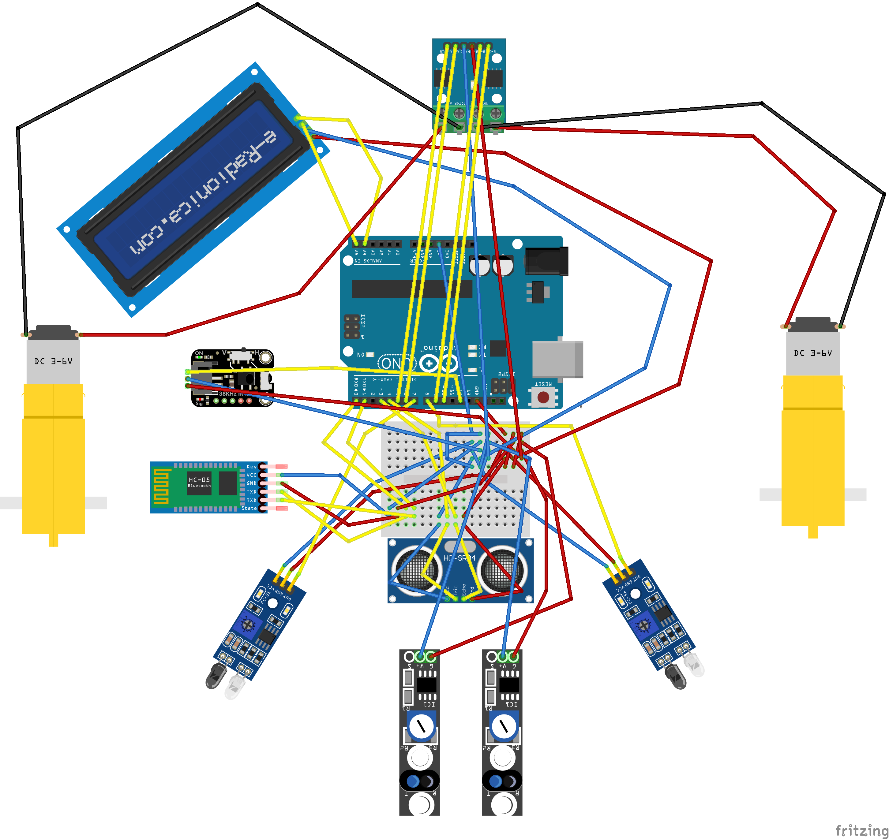
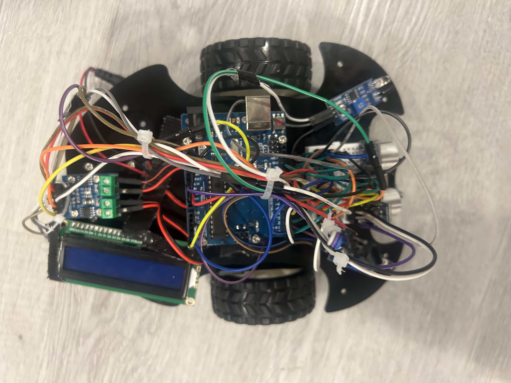
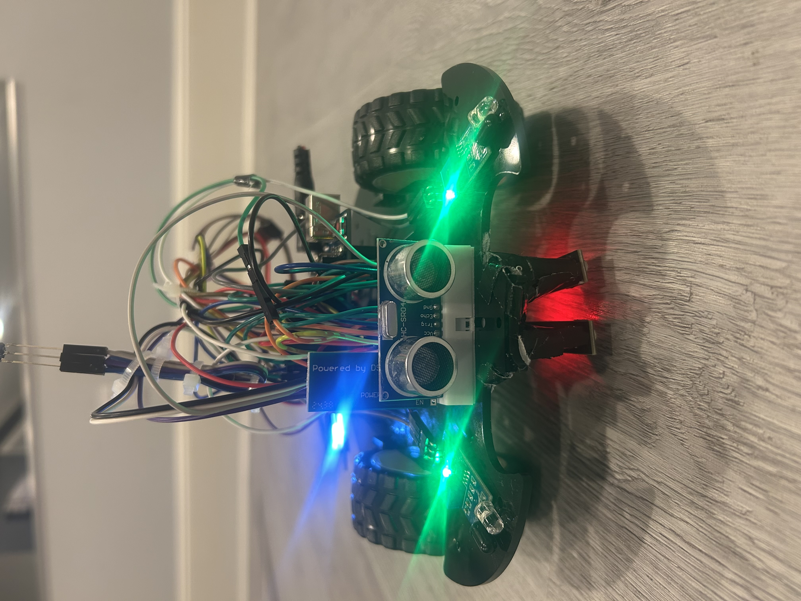
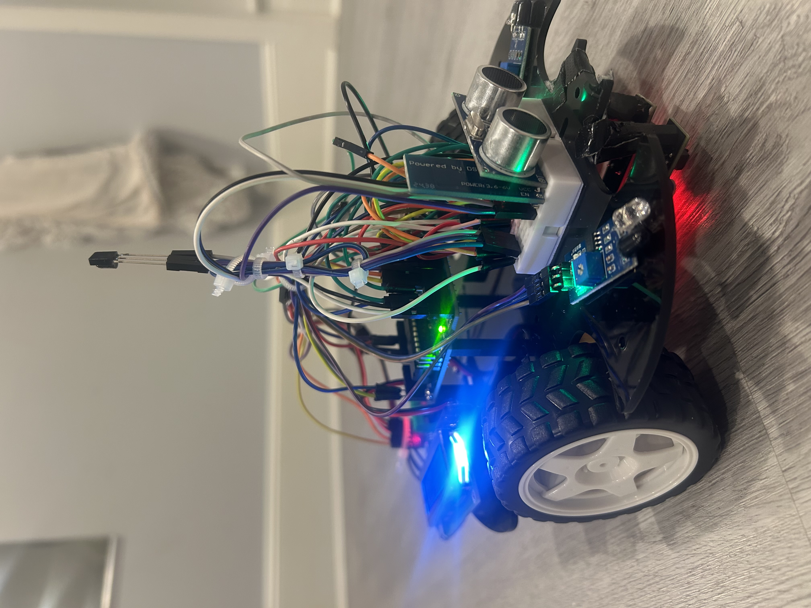

# Self Driving Car

My project is an Arduino-based self-driving car that uses ultrasonic and infrared sensors to detect obstacles and navigate autonomously. In addition to self-driving capabilities, the car includes a remote-control mode, allowing it to switch between manual and autonomous operation. This project combines programming, electronics, and robotics to demonstrate the fundamentals of autonomous vehicle technology.

| Engineer | School | Interests | Grade |
|:--:|:--:|:--:|:--:|
| Charles T | Paul D. Schreiber High School | AI and Software Engineering | Incoming Junior |

<p align="center">
  
</p>

# Final Milestone

[](https://youtu.be/imD-li7K2ZM)

(Keep your existing milestone text here.)

# Second Milestone

[](https://youtu.be/LZQw0s5oOHk)

(Keep your existing second milestone text here.)

# First Milestone

[](https://youtu.be/zcms080g7NM)

(Keep your existing first milestone text here.)

# Schematics

<p align="center">

</p>

<p align="center">


</p>

<p align="center">

</p>

# Code

```cpp
// Paste your Arduino code here.
```

# Bill of Materials

Keep your existing table, but convert every HTML link:
<a href="URL">Link</a>

to

[Link](URL)

Also ensure every URL starts with https://
